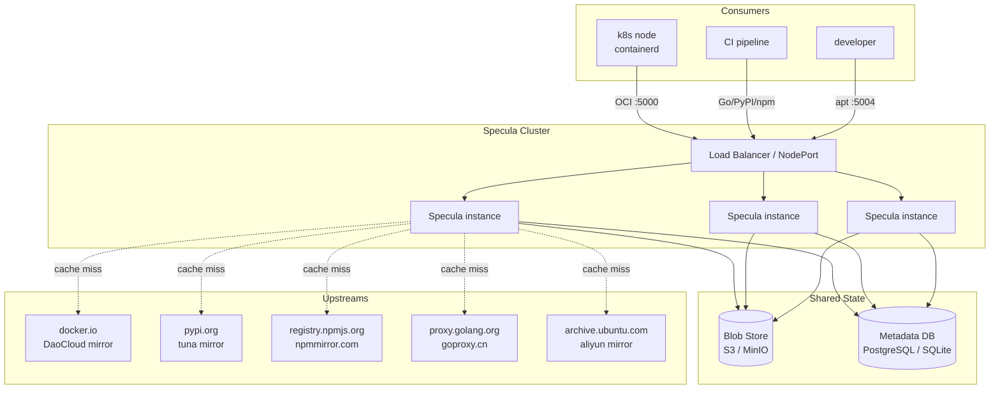
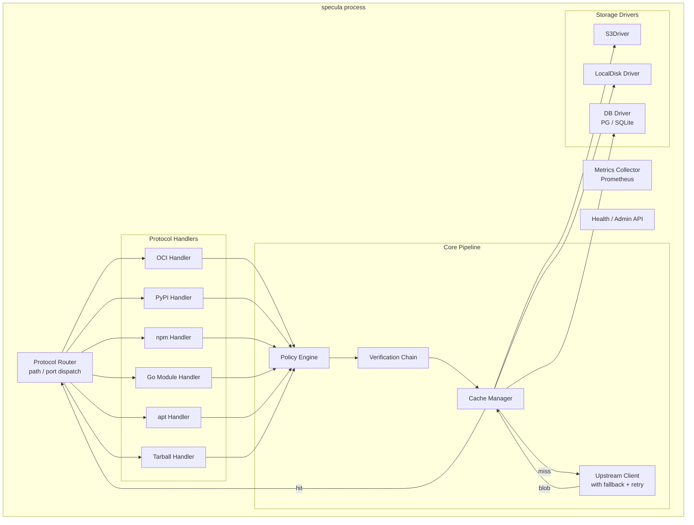
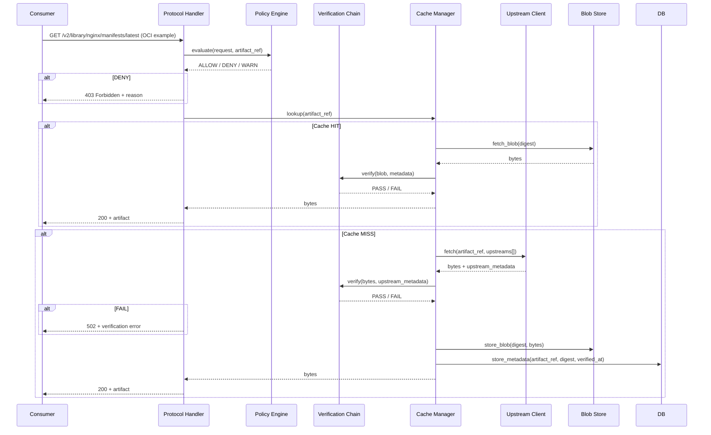
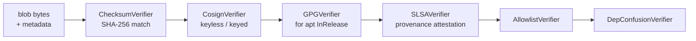
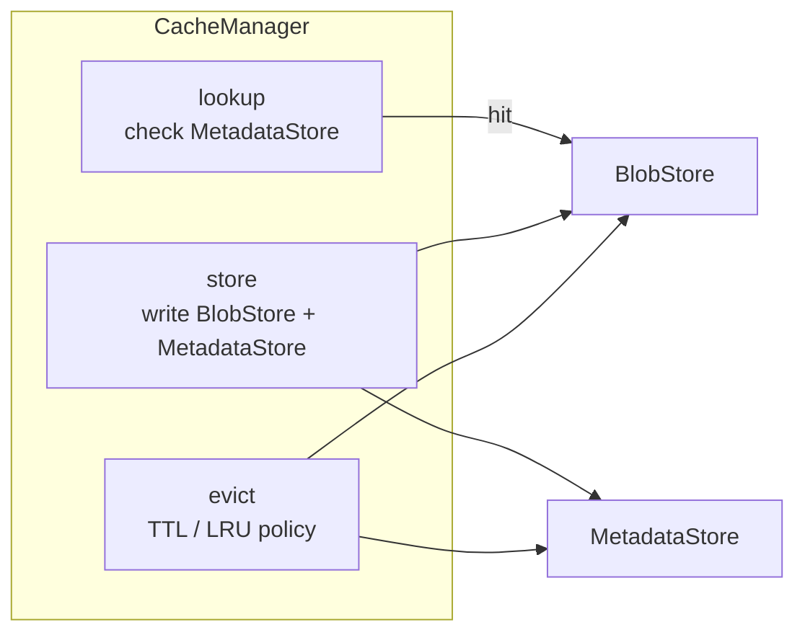
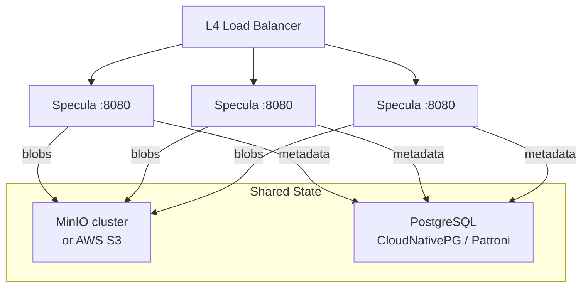
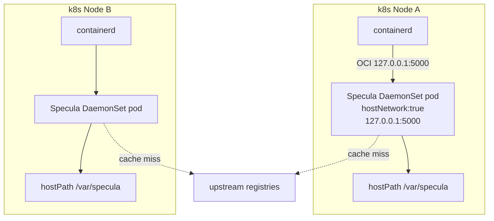

# Specula — Architecture

---

## 1. Overview

Specula is a **stateless Go daemon** that sits between consumers (cluster nodes,
CI pipelines, developer machines) and upstream artifact registries. It speaks
multiple artifact protocols simultaneously, caches blobs in an S3-compatible
store, and enforces a verification policy before serving any artifact to a
consumer.



---

## 2. Internal Component Architecture



---

## 3. Request Lifecycle

Every inbound request follows the same pipeline regardless of protocol:



---

## 4. Protocol Handlers

Each protocol handler is a self-contained package that:
1. Implements `http.Handler`
2. Translates its own URL scheme to a canonical `ArtifactRef`
3. Knows how to parse upstream responses for that protocol

```
internal/
  handler/
    oci/       — Docker v2 + OCI Distribution Spec v1
    pypi/      — PEP 503 Simple API + PEP 691 JSON API
    npm/       — npm registry protocol (GET /pkg/-/pkg-ver.tgz)
    gomod/     — GOPROXY protocol (/@v/list, /@v/{version}.info, .mod, .zip)
    apt/       — InRelease, Packages.gz, pool/ fetch
    tarball/   — URL-keyed generic cache
```

### ArtifactRef (canonical internal type)

```go
type ArtifactRef struct {
    Protocol string   // "oci" | "pypi" | "npm" | "go" | "apt" | "tarball"
    Name     string   // image name, package name, module path, …
    Version  string   // tag, version string, suite+component, …
    Digest   string   // sha256:… if known; empty on first lookup
}
```

---

## 5. Verification Chain

The `Verification Chain` is a pluggable pipeline of `Verifier` implementations.
Each verifier receives the blob bytes and the upstream metadata and returns
`PASS`, `WARN`, or `FAIL`. The policy engine decides whether `WARN` is treated
as `FAIL` for a given protocol.



Verifiers are registered per-protocol. Only relevant verifiers run (e.g. cosign
only for OCI, GPG only for apt).

```go
type Verifier interface {
    Name() string
    Verify(ctx context.Context, ref ArtifactRef, blob []byte, meta UpstreamMeta) (Result, error)
}

type Result struct {
    Status  Status // PASS | WARN | FAIL
    Message string
}
```

---

## 6. Cache Manager

The Cache Manager is protocol-agnostic. It operates on `(ArtifactRef, digest)`
pairs and delegates persistence to a `BlobStore` and a `MetadataStore`.



### BlobStore interface

```go
type BlobStore interface {
    Get(ctx context.Context, digest string) (io.ReadCloser, error)
    Put(ctx context.Context, digest string, r io.Reader, size int64) error
    Exists(ctx context.Context, digest string) (bool, error)
    Delete(ctx context.Context, digest string) error
}
```

Implementations:
- `S3Driver` — talks to any S3-compatible endpoint (MinIO, AWS, Ceph)
- `LocalDiskDriver` — stores under a configurable directory (dev / single-node)

### MetadataStore interface

```go
type MetadataStore interface {
    Get(ctx context.Context, ref ArtifactRef) (*CacheEntry, error)
    Put(ctx context.Context, entry CacheEntry) error
    Delete(ctx context.Context, ref ArtifactRef) error
    List(ctx context.Context, protocol string) ([]CacheEntry, error)
}
```

Implementations:
- `PostgresStore` — uses a single `cache_entries` table; safe for concurrent
  Specula instances
- `SQLiteStore` — embedded; suitable for single-instance / DaemonSet deployments
  where each node has its own DB

---

## 7. High-Availability Design



Key properties:
- **No leader election** — every instance is identical; any instance can serve
  any request
- **Concurrent cache writes are safe** — writing the same blob twice is
  idempotent (same digest → same bytes); the MetadataStore upserts on conflict
- **Upstream fetch deduplication** — a distributed lock (via PostgreSQL advisory
  lock or a short TTL Redis key) prevents cache stampede: the first instance to
  miss fetches from upstream, others wait and then read from cache
- **Rolling upgrades** — new instances come up before old ones drain; zero
  downtime

---

## 8. DaemonSet Deployment (Single-node per-node cache)

For clusters where each node should have a local cache (zero-hop latency), run
Specula as a DaemonSet with `hostNetwork: true`. Each instance uses a local
SQLite metadata store and local-disk blob store (or a shared MinIO).



In this mode, blobs are stored node-local. No shared storage is needed. Each
node fetches from upstream on cold start and caches locally thereafter.

---

## 9. Repository Layout

```
specula/
├── cmd/
│   └── specula/          — main entry point, flag parsing, server bootstrap
├── internal/
│   ├── config/           — YAML config model + validation
│   ├── handler/
│   │   ├── oci/          — OCI Distribution Spec handler
│   │   ├── pypi/         — PyPI Simple API handler
│   │   ├── npm/          — npm registry handler
│   │   ├── gomod/        — Go module proxy handler
│   │   ├── apt/          — apt HTTP handler
│   │   └── tarball/      — generic URL cache handler
│   ├── artifact/         — ArtifactRef, CacheEntry types
│   ├── cache/            — CacheManager, BlobStore, MetadataStore interfaces
│   ├── store/
│   │   ├── s3/           — S3Driver
│   │   ├── local/        — LocalDiskDriver
│   │   ├── postgres/     — PostgresStore
│   │   └── sqlite/       — SQLiteStore
│   ├── upstream/         — UpstreamClient, fallback chain, retry
│   ├── verify/
│   │   ├── checksum.go   — SHA-256/512 verifier
│   │   ├── cosign.go     — cosign keyless + keyed
│   │   ├── gpg.go        — GPG InRelease verifier
│   │   ├── slsa.go       — SLSA provenance verifier
│   │   └── depconfusion.go — dependency confusion guard
│   ├── policy/           — PolicyEngine, per-protocol rule evaluation
│   └── metrics/          — Prometheus collector
├── deploy/
│   ├── k8s/
│   │   ├── daemonset.yaml
│   │   ├── deployment.yaml   — HA deployment
│   │   └── configmap.yaml
│   └── helm/             — Helm chart (future)
├── docs/
│   ├── PRD.md
│   └── ARCHITECTURE.md
├── specula.example.yaml  — annotated config reference
├── Makefile
├── Dockerfile
└── LICENSE
```

---

## 10. Configuration Reference (abbreviated)

```yaml
# specula.yaml
server:
  bind: "0.0.0.0"
  port: 8080           # single-port mode (path-based routing)
  # Or per-protocol ports:
  ports:
    oci: 5000
    pypi: 5001
    npm: 5002
    go: 5003
    apt: 5004
    tarball: 5005
    admin: 8080
    metrics: 9090

storage:
  blobs:
    driver: s3           # s3 | local
    s3:
      endpoint: "http://minio:9000"
      bucket: specula-blobs
      access_key_id: "${MINIO_ACCESS_KEY}"
      secret_access_key: "${MINIO_SECRET_KEY}"
  metadata:
    driver: postgres     # postgres | sqlite
    postgres:
      dsn: "${POSTGRES_DSN}"
    sqlite:
      path: /var/specula/meta.db

cache:
  ttl: 24h
  max_blob_size: 10GB
  eviction: lru

protocols:
  oci:
    enabled: true
    upstreams:
      - https://docker.m.daocloud.io
      - https://registry-1.docker.io
    verification:
      checksum: enforce
      cosign:
        policy: warn
  pypi:
    enabled: true
    upstreams:
      - https://pypi.tuna.tsinghua.edu.cn/simple
      - https://pypi.org/simple
    verification:
      checksum: enforce
  npm:
    enabled: true
    upstreams:
      - https://registry.npmmirror.com
      - https://registry.npmjs.org
    verification:
      checksum: enforce
      dependency_confusion:
        private_namespaces: []
        private_upstream: ""
  go:
    enabled: true
    upstreams:
      - https://goproxy.cn
      - https://proxy.golang.org
    sumdb: https://sum.golang.org
    verification:
      sumdb: enforce
  apt:
    enabled: true
    upstreams:
      - http://mirrors.aliyun.com/ubuntu
      - http://archive.ubuntu.com/ubuntu
    verification:
      gpg: enforce
      keyring: /etc/specula/ubuntu-archive-keyring.gpg
```

---

## 11. Tech Stack

| Concern | Choice | Rationale |
|---|---|---|
| Language | Go 1.22+ | Single static binary, fast HTTP, OCI SDK in Go |
| HTTP router | `net/http` + `gorilla/mux` | Standard, no magic |
| S3 client | `minio-go` | Works with any S3-compatible backend |
| OCI client | `google/go-containerregistry` | Battle-tested, used by crane/skopeo |
| cosign | `sigstore/cosign` (library) | Keyless + keyed signature verification |
| PostgreSQL | `jackc/pgx` | Best-in-class Go PG driver |
| SQLite | `mattn/go-sqlite3` or `modernc.org/sqlite` | Pure Go option for CGO-free builds |
| Metrics | `prometheus/client_golang` | Standard |
| Config | `koanf` | Flexible multi-source config (YAML + env override) |
| Logging | `log/slog` | Structured JSON, stdlib since Go 1.21 |
| Testing | `testify` + `testcontainers-go` | Integration tests against real S3 / PG |
