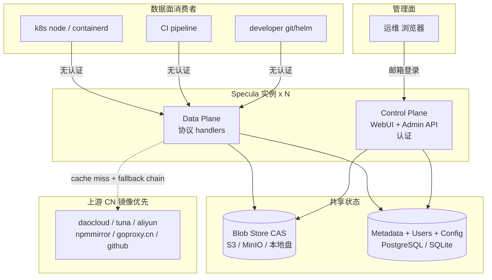
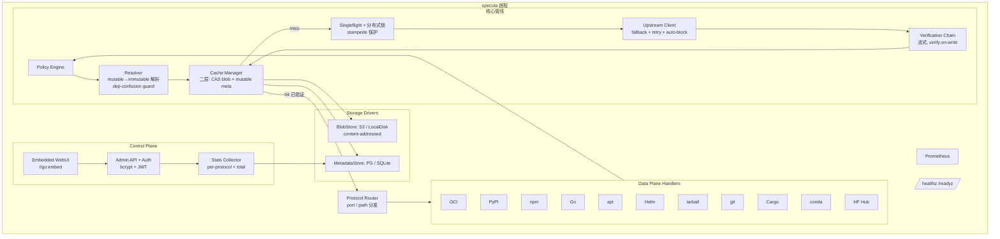
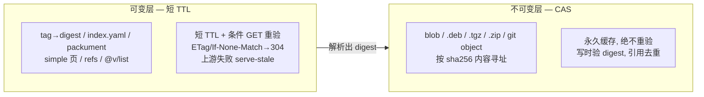
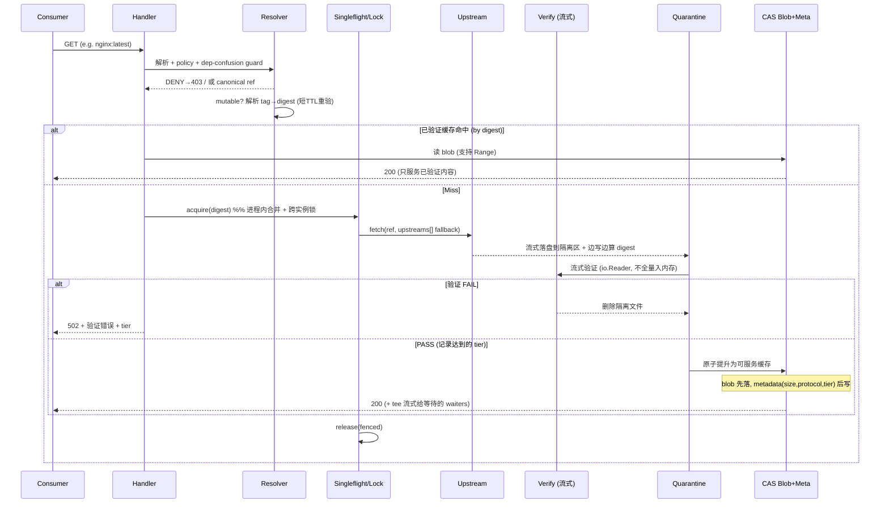
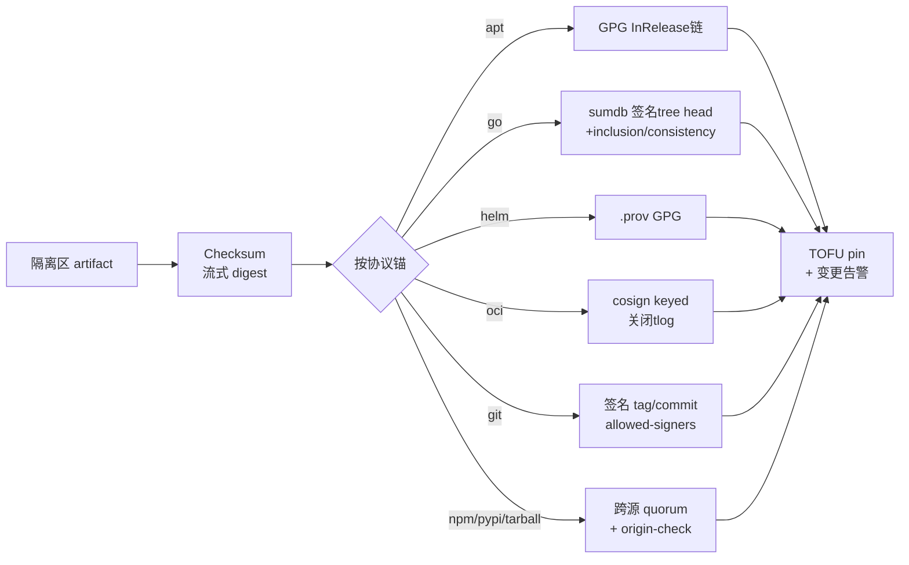
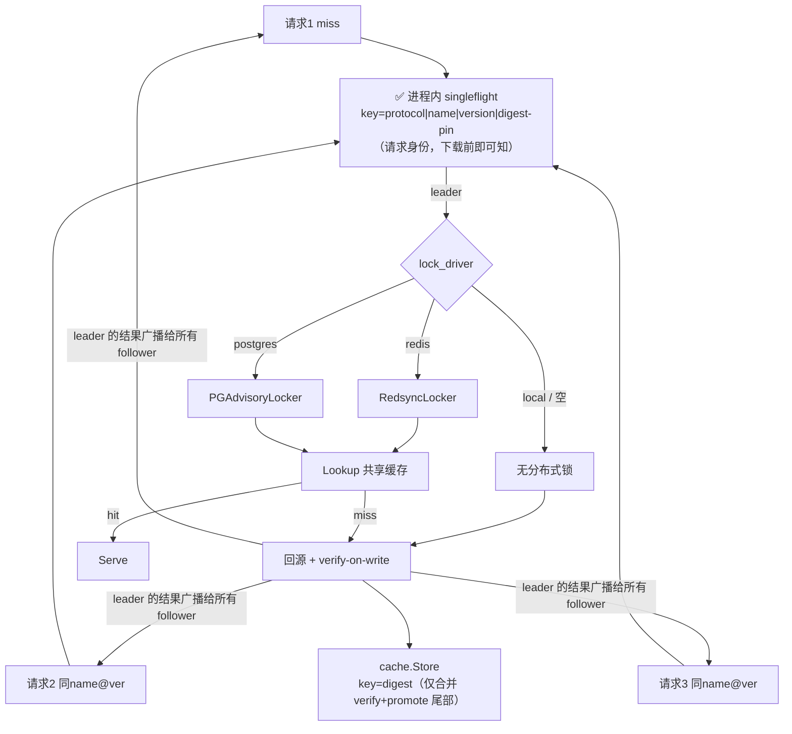
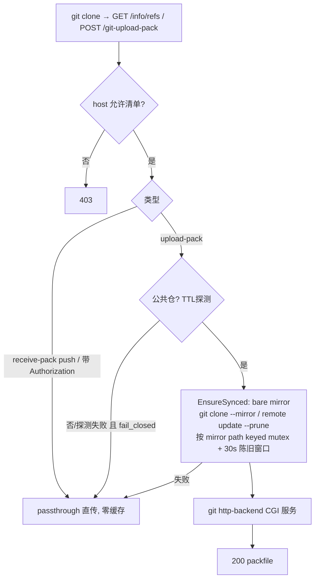
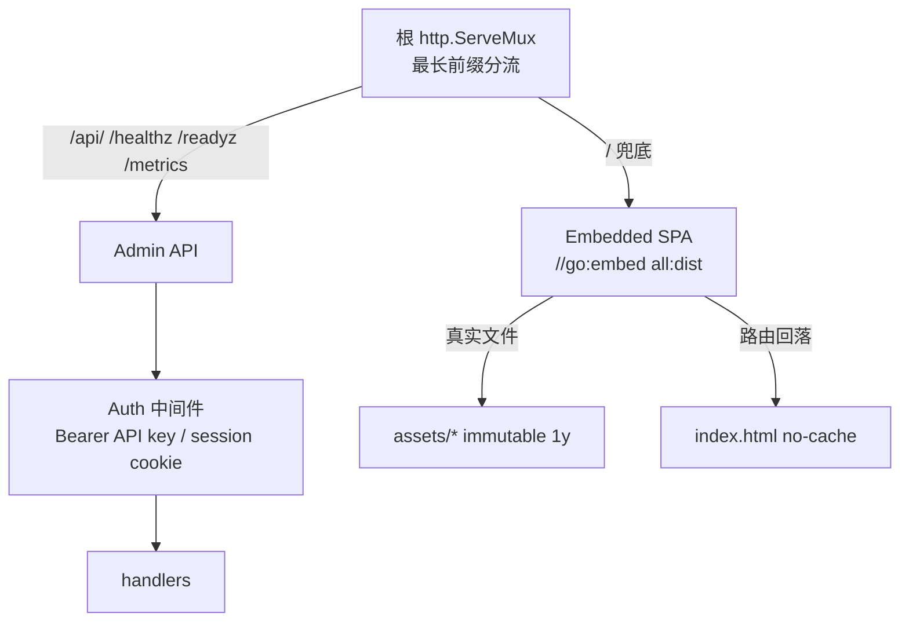
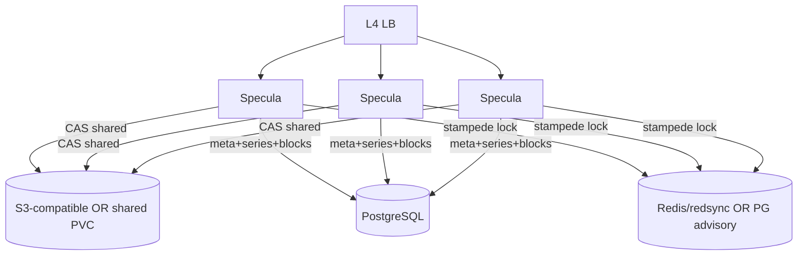

# Specula — Architecture (v0.2)

> 强化依据见 [DESIGN-REVIEW.md](./DESIGN-REVIEW.md)；需求见 [PRD.md](./PRD.md)。
> v0.2 关键变化：双平面架构、二层缓存(CAS)、verify-on-write 隔离区、流式验证接口、
> 两层 stampede 保护、缓存容量统计、新增 Helm/git、内嵌 WebUI + 邮箱认证。
>
> **库化**：公开 API 见 [LIBRARY.md](./LIBRARY.md)；`cmd/specula` 是 `pkg/*` 之上的薄壳。

---

## 0. Library surface (SDK + Embed)

任意 Go 项目可通过 `pkg/` 接入同一套核心管线，无需运行 daemon：

| 层 | 包 | 用途 |
|---|---|---|
| L1 SDK | `pkg/specula` | `Get` / `Open` / `VerifyFile` |
| L2 Embed | `pkg/handler/*` + `Server.Mount` | 挂到现有 `http.ServeMux` |
| L3 Daemon | `cmd/specula` | YAML + 控制面 WebUI |

实现仍主要在 `internal/`；`pkg/` 为稳定再导出 + Facade。重依赖驱动（S3 / Postgres）为 opt-in 子包。

---

## 1. Overview — 双平面架构 (Two-Plane)

Specula 是一个**无状态 Go 守护进程**，明确分为两个平面：

- **数据面 (Data Plane)**：11 协议拉取端点。无消费者认证（可信网段/mTLS/网络策略把边界），
  高吞吐。核心是"取回 → **验证** → 缓存 → 服务"管线。
- **管理面 (Control Plane)**：单一二进制内嵌 WebUI，带**邮箱认证**（首个=admin）。
  看缓存统计、验签告警、配策略、管上游健康、GC。



---

## 2. Internal Components



---

## 3. 二层缓存模型 (Two-Tier Cache) — 核心

所有成熟方案的共识不变式（DESIGN-REVIEW §3）：**把世界分成不可变内容与可变元数据**。



| 协议 | 不可变 (CAS 永久) | 可变 (短 TTL 重验) | 默认 mutable TTL |
|---|---|---|---|
| OCI | blob/config/manifest by digest | tag→digest（HEAD 探测，不耗限额） | 见 config |
| Go | `@v/<v>.{info,mod,zip}` | `@v/list`, `@latest` | 5min |
| PyPI | wheel/sdist 文件 | `/simple/<pkg>/` 页 | 30min |
| npm | `*.tgz` | packument | 2min |
| apt | `pool/*.deb` | InRelease/Packages | revalidate（by-hash 免race）|
| Helm | chart `*.tgz` | `index.yaml` | 30min |
| git | git object by SHA | refs | 30s |
| tarball | 内容 by sha256 | — | — |
| Cargo | `.crate` by digest | sparse index JSON / `config.json` | 5min |
| conda | `.conda` / `.tar.bz2`（repodata sha256 pin） | `repodata.json` | 5min |
| Hugging Face | 公开文件 / LFS 对象 | Hub API / refs / tree | 2min |

**数据面挂载（路径前缀 → handler）**：

| 前缀 | 协议 |
|---|---|
| `/v2/` | OCI (+ registry token) |
| `/pypi/` | PyPI |
| `/npm/` | npm |
| `/go/` | Go modules (+ `/sumdb/` 透传) |
| `/apt/` | apt |
| `/helm/` | Helm HTTP repo |
| `/tarball/` | generic URL cache |
| `/git/` | git smart-HTTP |
| `/cargo/` | Cargo sparse registry |
| `/conda/` | conda channel |
| `/hf/` | Hugging Face Hub（`HF_ENDPOINT`）|

**config 哨兵**：`ttl: -1` = 永不重验（不可变），`ttl: 0` = 每次重验。
**负缓存**：404 短 TTL 缓存（默认 30min），吸收 miss-stampede，且被 singleflight 合并。

---

## 4. 请求生命周期 — verify-on-write / quarantine

**修复 v0.1 C2（流式验证悖论）**：绝不把未验证的上游字节流式转发给客户端。



**要点**：
- **verify-on-write**：只从**已验证**的 CAS 缓存对外服务。隔离区文件验证通过才原子提升。
- **流式验证**（修 C3）：Verifier 拿 `io.Reader`/文件句柄，digest 用 `hash.Hash` 边写边算；
  签名验证对落盘文件做，不驻留内存。多 GB layer 不入内存。
- **写序**（修 M1）：blob 先落 CAS，metadata 后写；读路径把"meta 命中但 blob 缺失"当 miss；GC 清孤儿。
- **tee 流式**：大 blob 回填 CAS 的同时，喂给同一 digest 上等待的 waiters（zot 模式），单上游出口。
- **请求级 digest pin（pin ≠ 重验）**：调用方显式 pin 的 digest（如 tarball `?digest=`）是一条
  **请求自身的完整性断言**——"给我这些字节，否则失败"。CAS 不可变层按
  `(protocol, name, version)` 建键，**digest 不参与建键**，因此按 URL/名字命中的条目可能持有
  任意 digest。故 `cache.Lookup` 必须把 pin 与**命中条目**的 digest 比对，不匹配即
  `PinMismatchError` → 502，与 cold path 行为一致。
  - 这是**元数据比对**，不是**重验字节**：§3 的"CAS 永久缓存，绝不重验"依然成立
    （仍然信任已存字节，只是拒绝用工件 Y 回答对 X 的请求）。绝不因为一个 pin 就重算 blob 哈希。
  - 只在 miss 路径校验 pin 会**静默失效于每次缓存命中**（即生产环境的绝大多数请求）——
    断言在测试中有效、在负载下失效，比 cold path 正确更危险。
  - pin 不匹配**绝不驱逐/失效**已缓存条目（不可作缓存拒绝服务的杠杆），
    也**不触发上游重取**（不可作上游放大的杠杆）。
  - pin 是**可选**的：`ref.Digest == ""` 表示无断言，行为不变。

---

## 5. Verification Chain — 流式 + 四档

```go
// 修 C3：流式，不是 blob []byte
type Verifier interface {
    Name() string
    Tier() Tier // signed | consensus | tofu | checksum
    // 对隔离区文件流式验证；digest 已边写边算
    Verify(ctx context.Context, ref ArtifactRef, art *Artifact) (Result, error)
}

type Artifact struct {
    Path      string    // 隔离区文件路径（不驻留内存）
    Digest    string    // sha256:...（流式计算所得）
    Size      int64
    Meta      UpstreamMeta // ETag, Last-Modified, 来源 upstream, 签名/prov 附件
}

type Result struct {
    Status  Status // PASS | WARN | FAIL
    Tier    Tier   // 实际达到的档
    Message string
}
```

按协议注册相关 verifier，链式短路：



**四档落地要点**：
- `signed`：见上表锚。cosign 默认 `keyed --insecure-ignore-tlog`（CN Rekor 被墙）；sumdb 走
  `sum.golang.google.cn`；apt/helm 用本地 keyring；git 用 allowed-signers。
- `consensus`：从 N 个独立镜像**并行取 digest/manifest**（HEAD/metadata 阶段，不下载全 blob），
  ≥quorum 一致才 PASS；可选 origin-check 经出口代理直连官方源比对。
- `tofu`：首次锁定 digest 入库，后续同一不可变版本变更即告警/fail。git 额外检测非快进 ref 更新（force-push/改史）。
- **maturity / cool-down**（v0.10，**策略闸而非信任档**）：对 npm/PyPI/Cargo，优先用
  registry 公布的发布时间（npm `packument.time`、PyPI PEP 691 / Warehouse、
  crates.io `created_at`），否则回退 `Last-Modified`；距今 `< min_age` 时按
  `warn|enforce` 告警或拒绝入缓存。用于压缩维护者劫持后毒版首发窗口；无发布时间则
  Skip（不伪造年龄）。**不**等同 anti-rollback。
- **anti-rollback**（v0.12 规划，修 H2）：per-channel 单调版本状态——拒绝比已见更低版本的**已签名索引**。

**dependency confusion guard**（修 H3/H4）：见 DESIGN-REVIEW §4 + [TRUST.md](./TRUST.md)。
私有名私有源宕机 **fail-closed**。客户端必须 sole-index；`integrate` 不得把旧 PyPI 源塞进
`extra-index-url`。Admin Events（进程内 + meta DB 持久化）记录 verify fail/warn 与 TOFU 漂移。

---

## 6. Cache Manager & Storage — CAS

Cache Manager 协议无关，操作 `(canonical ref, digest)`，委托 `BlobStore`(CAS) + `MetadataStore`。

```go
// 修 M2：支持 Range（containerd 断点续传）；size 读写内联返回
type BlobStore interface {
    Get(ctx context.Context, digest string, offset, length int64) (io.ReadCloser, int64, error)
    Put(ctx context.Context, digest string, r io.Reader, size int64) error // 幂等；同 digest 同字节
    Exists(ctx context.Context, digest string) (bool, error)
    Delete(ctx context.Context, digest string) error
    UsageBytes(ctx context.Context) (int64, error) // 后端总用量（可选/缓存）
}
```
实现：`S3Driver`（aws-sdk-v2，path-style，tmp→Head 取 size→Copy 提升，硬链接不可用时引用计数 DB）、
`LocalDiskDriver`（内容寻址分片目录 + 硬链接去重）。**复用 ai-sandbox `workspace.Backend` 接口 + StorageFactory**（补本地盘 driver）。

```go
type MetadataStore interface {
    Get(ctx, ref ArtifactRef) (*CacheEntry, error)
    Put(ctx, entry CacheEntry) error // 记录 digest, size, protocol, tier, upstream, verified_at, etag
    Delete(ctx, ref ArtifactRef) error
    // 修 H1：可变元数据带 TTL + 条件重验状态
    GetMutable(ctx, key string) (*MutableEntry, error) // tag→digest, index, packument...
    // G7：统计聚合
    CacheSizeByProtocol(ctx) (map[string]SizeStat, error) // SUM(size),COUNT GROUP BY protocol
}
```
- `PostgresStore`（并发安全，`ON CONFLICT` upsert）
- `SQLiteStore`（WAL 模式；**仅单实例节点本地，不跨实例共享**——修 L2）

**CAS 去重**（偷 Artifactory/zot）：相同字节物理存一份，path→digest 映射入 DB，
copy/move/delete = 引用操作，末次引用才物理删。

---

## 7. Stampede 保护 — 两层设计（均已接线）(修 M3)

> **实现状态**：第 1 层（进程内 singleflight）与第 2 层（跨副本 `coalesce.Locker`）**均已接线**。
> 冷取路径走 `coalesce.FetchLocked`：同副本合并后，可选分布式锁；**Acquire 之后必须 Lookup 再回源**
> （否则第二个副本在第一个释放后仍会回源，等于白锁）。`lock_driver=redis`（默认 HA）用
> redsync；`lock_driver=postgres` 用 meta 池上的 session advisory lock（无 Redis 的 HA）。
> 历史上 coalescer 曾只在 `cache.Store` 按 digest 合并（digest 要等下载完成才知道），挡不住回源；
> 现已改为按**请求身份**（`FetchKey`）在 handler 冷取路径合并。



- **进程内（已实现）**：`golang.org/x/sync/singleflight`，按 key 分片（16 个 Group）降低锁竞争。
  合并发生在 **handler 的冷取路径**（gomod / apt / npm / pypi / helm / oci / tarball / cargo / conda / hf 等），
  由 `coalesce.Fetch` / `FetchLocked` + `coalesce.FetchKey` 统一。
  - **key 必须是「请求身份」而非内容 digest**：digest 只有在下载完成后才知道，用它做 key
    只能合并「verify+promote」这个便宜的尾巴，永远挡不住它本该阻止的那次下载。
    `cache.Store` 的 digest 合并**保留**（对同内容的并发 promote 仍然有意义），但它**不是**
    stampede 保护。
  - **digest pin 参与 key**：pin 是断言（「给我这些字节，否则失败」）。两个 pin 不同的调用者
    不是同一个请求，合并它们会把与调用者 pin 矛盾的产物递给它 —— 那是拿性能 bug 换正确性 bug。
  - **错误语义**：leader 失败时 follower **共享 leader 的错误，不各自回源**。上游正在出问题时
    让 N 个 follower 各自再打一遍，正是这个 bug 最痛的复现场景；而 leader 那一次调用内部
    **已经做完**了配置的重试与多上游 fallback，follower 再试并不是新机会，只是同一次尝试的重复。
    这**不会**把一次抖动放大成 N 次失败：错误返回后每个 handler **各自独立**走 serve-stale
    （§3），降级仍是每请求粒度且零额外回源。错误**不缓存**（singleflight 在 fn 返回即丢弃在飞
    条目），故抖动在下一个请求即自愈。
  - **有界等待**：follower select 自己的 ctx，客户端断开/超时即刻释放，不依赖 leader 守规矩；
    leader 自身由上游客户端的 30s 整请求超时兜底（「leader 很慢」是常态而非边界情况：
    实测某 aliyun 链路 27 kB/s）。
  - **陷阱防护**：panic 在 DoChan 的新 goroutine 重抛会崩进程 → `wrapFn` recover 成 `*PanicError`
    并 `Forget` 该 key，下一个调用者重新开始。
  - **刻意未实现**：本节旧图里的「waiter 等待超时后自行回源」。waiter 超时后各自回源，就是这里
    要消除的 stampede 本身，只是延迟了一个超时而已。follower 自己的 ctx 才是诚实的边界。
- **跨实例（已接线）**：`cmd/specula` 的 `buildStampedeLocker` 按 `coalesce.lock_driver` 构造
  `Locker`，并经 `WithLocker` 注入各协议 handler；冷取走 `FetchLocked`（Acquire → Lookup → miss 才 `fn`）。
  - **`redis`（HA 默认）**：`coalesce.NewRedsyncLocker`（go-redsync + go-redis）。空 `lock_driver` 且
    `server.ha=true` 时仍默认 redis。
  - **`postgres`（可选，无 Redis HA）**：`postgres.NewPGAdvisoryLocker(metaPool)`，要求
    `storage.meta.driver=postgres`。Session-level advisory lock：**持锁期间占用池连接一条**，
    高并发冷 miss 时需相应放大 `pgx` pool；进程崩溃则连接关闭、锁自动释放。
  - **`local` / 空（非 HA）**：nil Locker，仅进程内 singleflight。
  - **git**：路径级 mutex 合并 clone/fetch，不走本 Locker（节点本地 bare mirror）。
- **已实现**：可变元数据用 XFetch 概率提前刷新（避免同步过期悬崖）+ stale-while-revalidate（RFC 5861）：
  soft-expiry 时 `Lookup` 仍返回条目并设 `SoftExpired`，handler 立即响应并后台 coalesced 重验；
  hard-TTL 过期仍走既有同步 revalidate / serve-stale-on-failure。

---

## 8. Protocol Handlers

```
internal/handler/
  oci/    — Docker v2 + OCI Distribution v1；go-containerregistry 底座；tag HEAD 探测
  pypi/   — PEP 503/691；单 index 模式；dep-confusion guard
  npm/    — registry 协议；scope 绑定 + unscoped 黑名单
  gomod/  — GOPROXY(/@v/list,.info,.mod,.zip) + /sumdb/ 透传验证(x/mod/sumdb)
  apt/    — InRelease/Packages/pool；GPG 端到端链验证；by-hash 免race
  helm/   — OCI 形态转 oci handler；经典 repo: index.yaml + tgz + .prov
  tarball/— URL-keyed 内容寻址缓存
  git/    — 见 §9
```

**ArtifactRef**（canonical 内部类型）：

```go
type ArtifactRef struct {
    Protocol string
    Name     string  // image / package / module path / repo host+path
    Version  string  // tag / version / suite+component / ref
    Digest   string  // 解析后填充；CAS 键
    Upstream string  // 来源上游（M4：记录以检测跨源冲突）
    Mutable  bool    // tag/index/ref = true → 走可变层
}
```

---

## 9. git clone 加速 Handler (新)

**直接移植 ai-sandbox `internal/controlplane/ptc/gitproxy/`**（DESIGN-REVIEW §6）。



- **缓存 = 磁盘 bare mirror**（非 blob store）：git objects 天然按 SHA 内容寻址=不可变；refs=可变短 TTL。
- **stampede**：按 mirror path 的 `sync.Mutex` + 陈旧窗口（并发 clone 不重复 fetch）。
- **信任**：`checksum`=git 固有 SHA Merkle；`tofu`=ref→SHA 锁定 + **force-push/改史告警**（非快进更新）；
  `signed`=验签名 tag/commit（allowed-signers）；`consensus`=跨镜像比对 ref→SHA。
- **透传**：partial/shallow clone（`filter=blob:none`）透传；私有仓/带 PAT → bypass 零缓存。
- 不用 `elazarl/goproxy`；用 `httputil.NewSingleHostReverseProxy` 做 passthrough。

---

## 10. 缓存容量统计 (G7)

**权威来源 = MetadataStore（写时记 size，非遍历 FS）** —— 偷 ai-sandbox `AllOrgStorageBytes` 模式。

```mermaid
graph LR
    put[blob Put 时] -->|记 size,protocol,tier| meta[(MetadataStore)]
    meta -->|SUM(size),COUNT GROUP BY protocol| agg[聚合 O(1) 精确]
    agg --> prom[Prometheus<br/>specula_cache_bytes{protocol}<br/>total = sum()]
    agg --> api[Admin API GET /admin/stats<br/>per-protocol {bytes,objects,oldest,newest}<br/>+ grand total + 后端容量]
    agg --> ts[DB 时序表<br/>历史曲线 环形缓冲]
    gc[GC/eviction] -->|同步扣减| meta
    disk[statfs gopsutil / S3 UsageBytes] --> api
    subgraph opaque[不透明缓存: git bare mirror]
        du[du -sb 兜底] --> agg
    end
```

- 原生 handler：`SUM(size) GROUP BY protocol`，O(1) 精确，per-protocol + total 天然。
- git bare mirror（不透明）：`du -sb` 兜底采集（ai-sandbox collector 模式）。
- 跨节点（DaemonSet/HA）：各实例本地统计，Admin API 按 protocol 求和 + 总量求和；CP 从不远端 du。
- 与 GC/eviction 联动扣减，保证统计与实际一致。

---

## 11. Control Plane — 内嵌 WebUI + 认证 (G6)

**整包复用 ai-sandbox `auth/` + `web/embed.go`**（DESIGN-REVIEW §6），裁掉多租户 org/acl。



- **用户模型**：`users(id,email,password_hash,system_role,token_gen,...)`；**首个 = admin**（`CountUsers()==0`）。
- **认证**：bcrypt.DefaultCost 密码（用户不存在跑 dummy bcrypt 防枚举）；手写 HS256 JWT（stdlib，拒 alg=none/RS*）
  in httpOnly + SameSite=Lax + Secure(HTTPS) cookie；`token_gen` 快照入 claims → logout 服务端 bump 撤销所有会话。
- **中间件双通道**：Bearer API key（`spck_` 前缀）→ 本地 session（JWT cookie/Bearer）。cookie+改状态+跨源 → 403。
  （无独立 admin-key 破窗通道：静态密钥旁路会绕过多租户 RBAC、`token_gen` 撤销与按用户审计；恢复走首用户引导/运维层，见 PRD §G6。）
  CLI 把同一 `spck_` key 存到 `~/.config/specula/credentials.json`（`specula login`），供 `specula stats` 调
  `GET /api/v1/stats`；也可用 `SPECULA_TOKEN` / `SPECULA_ADDR` 覆盖。
- **WebUI**：React18 + Vite + Tailwind"工程控制台"暗色（IBM Plex Mono + 琥珀 #ffb02e + 发丝线 + 近直角）。
  页面：缓存统计仪表盘、验签/告警、策略配置、上游健康、GC 操作、用户管理。
- **构建**：Makefile `ui` 先 `vite build`→`web/dist`，再 `go build` 嵌入；`web/dist/.gitkeep` 让裸 clone 可编译。
- **密钥引导**：`ensureSecret` 首次运行随机生成 HS256/config 密钥并持久化加密配置库，不可持久大声告警。

---

## 12. HA & 部署

**硬约束：HA 面只用成熟库 / 成熟 chart，禁止造轮子。** 允许的代码形态只有对本仓接口的薄适配（如 `coalesce.Locker` → redsync）与对本仓已有栈的常规用法（pgx + goose、aws-sdk S3）。



### 成熟库矩阵

| 关注点 | 选型 | 本仓动作 |
|---|---|---|
| 跨副本 stampede 锁 | **go-redsync/redsync/v4** + **go-redis/v9**（推荐）或 **pgx advisory lock** | `NewRedsyncLocker` / `NewPGAdvisoryLocker` → `FetchLocked` |
| 元数据 / 多租户 / series / blocks | **jackc/pgx/v5** + **pressly/goose/v3** | HA 强制 `meta.driver=postgres`；迁移 `009_runtime_state` |
| 共享 CAS | **aws-sdk-go-v2**（任意 S3 兼容）**或** `blob.driver=local` + `local.shared=true`（PVC/NFS） | **不**强制 AWS/MinIO |
| 同副本合并 | **x/sync/singleflight** | 不改 |
| K8s | **Helm 3** + Bitnami `postgresql` / `redis`；MinIO **可选** | `deploy/helm/specula`；`scripts/ha-minikube.sh` |

### 配置开关（`server.ha=true`）

- `storage.meta.driver=postgres`
- `coalesce.lock_driver=redis` + `coalesce.redis.addr` **或** `coalesce.lock_driver=postgres`（共用 meta 池；持锁占连接）
- CAS：`blob.driver=s3` **或** `blob.driver=local` 且 `local.shared=true`
- **git**：HA Deployment **关闭**（节点本地 bare mirror，非共享 CAS）

单节点 / DaemonSet：SQLite + 本地盘 + 进程内 singleflight（`lock_driver` 空/`local`）。

- **无 leader election**：实例同质；写同 blob 幂等；MetadataStore upsert。
- **stampede**：同副本 singleflight；跨副本 redis 或 PG advisory；`FetchLocked` 在 Acquire 后 Lookup 再回源。
- **Helm 安装**：见 [`deploy/helm/specula/README.md`](../deploy/helm/specula/README.md)；本地验收 `./scripts/ha-minikube.sh`（暖 manifest → 杀副本 → 再拉仍 200）。

### Bootstrap / 中国自举

HA 多副本能跑，但在拉不到 `docker.io` / `registry.k8s.io` 的集群里，真正的缺口是：
**先把 Specula 自己落地，再让其它镜像透过 Specula 进来**（鸡生蛋）。

| Phase | 含义 |
|-------|------|
| 0 | 单副本 sqlite + local；镜像/二进制已在节点（离线 tar / ACR / `docker load`） |
| 1 | Privileged DaemonSet：`specula bootstrap-mirror write` 写 containerd `certs.d` → NodePort |
| 2 | Job：`specula bootstrap-prefetch` 预热 HA 依赖清单 |
| 3 | `helm upgrade` 升完整 HA chart（installer Job 可选） |

硬前提：引导 Specula 的 OCI upstream 必须**国内可达**（默认 DaoCloud
`docker.m.daocloud.io`），不能写死 `registry-1.docker.io`。Phase 1/2 容器只用
Specula 自身镜像（distroless，无 busybox）。Chart：
[`deploy/helm/specula-bootstrap`](../deploy/helm/specula-bootstrap)；验收：
`./scripts/bootstrap-minikube.sh`（containerd profile）。

---

## 13. Repository Layout

```
specula/
├── cmd/specula/            — 入口, flag, bootstrap, 根 ServeMux
├── internal/
│   ├── config/             — YAML 模型 + 校验 + 加密配置库
│   ├── handler/            — oci pypi npm gomod apt helm tarball git cargo conda hf
│   ├── artifact/           — ArtifactRef, CacheEntry, Tier
│   ├── cache/              — CacheManager, 二层缓存, quarantine 提升
│   ├── store/
│   │   ├── s3/ local/      — BlobStore CAS drivers
│   │   ├── postgres/ sqlite/ — MetadataStore + goose
│   │   └── runtimestate/   — HA series + upstream blocks (pgx)
│   ├── upstream/           — fallback chain, retry, auto-block, 条件GET
│   ├── coalesce/           — singleflight + redsync Locker
│   ├── verify/
│   │   ├── checksum.go cosign.go gpg.go sumdb.go
│   │   ├── helmprov.go gitsigned.go
│   │   ├── consensus.go    — 多镜像 quorum + origin-check
│   │   ├── tofu.go         — 首次锁定 + 变更告警 + anti-rollback
│   │   └── depconfusion.go — 分生态 + fail-closed
│   ├── policy/             — 每协议策略评估
│   ├── stats/              — per-protocol + total 聚合, series backend
│   ├── auth/               — bcrypt + HS256 JWT
│   ├── admin/              — Admin API handlers
│   └── metrics/            — Prometheus
├── deploy/helm/specula/    — HA Helm chart (Bitnami PG/Redis, optional MinIO)
├── deploy/helm/specula-bootstrap/ — 中国/离线自举 (sqlite+local, mirror DaemonSet)
├── scripts/ha-minikube.sh  — minikube + helm HA 验收
├── scripts/bootstrap-minikube.sh — containerd 自举 Phase 0–2 验收
├── web/                    — React+Vite+Tailwind; embed.go
├── docs/                   — PRD.md, ARCHITECTURE.md, DESIGN-REVIEW.md
├── specula.example.yaml, Makefile, Dockerfile, LICENSE
```

---

## 14. Tech Stack

| Concern | Choice | Rationale |
|---|---|---|
| 语言 | Go 1.22+ | 单静态二进制 |
| HTTP | `net/http`（Go 1.22 method+pattern 路由） | 无魔法 |
| OCI | `google/go-containerregistry` | crane/skopeo 同底座 |
| cosign | `sigstore/sigstore`（keyed） | CN 离线可验 |
| Go sumdb | `golang.org/x/mod/sumdb` | 签名 tree head + 证明验证 |
| git | bare mirror + `git http-backend` | 公共 clone 加速 |
| S3 | `aws-sdk-go-v2` | R2/MinIO/OSS 通用 |
| PostgreSQL | `jackc/pgx` | 最佳 PG driver |
| SQLite | `modernc.org/sqlite` | 纯 Go, CGO-free |
| 迁移 | `pressly/goose` | 内嵌 SQL 迁移 |
| stampede | `singleflight` + **redsync** / **PG advisory** | 同副本 + 跨副本（HA） |
| 系统统计 | `shirou/gopsutil` | statfs 容量 |
| 认证 | bcrypt + JWT | 无重依赖 |
| 前端 | React18 + Vite + Tailwind | 工程控制台 |
| 配置 | `koanf`（YAML + env） | 多源 |
| 日志 | `log/slog` | 结构化 JSON |
| 测试 | `testify` + miniredis | 真 Redis 锁单测 |
| HA 部署 | Helm + Bitnami PG/Redis | 成熟 chart，不自研 infra |
